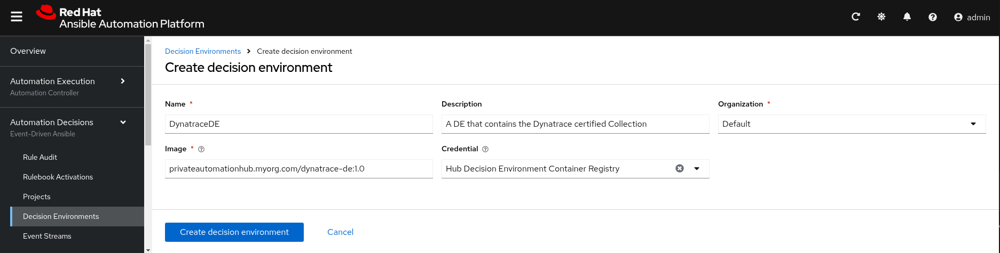

# Custom Dynatrace Decision Environment
To use the Dynatrace EDA Plugins, you must build a Decision Environment that contains the `dynatrace.event_driven_ansible` collection. 

The file named `dynatrace-de.yml` is a definition file for use with ansible builder to build a DE based on the official Minimal DE container image, and adds 2 collections:
* ansible.eda
* dynatrace.event_driven_ansible

To use the definition file:
1. Populate the ansible.cfg file with the configuration information for Automation Hub to use as a source for your collections
   The information needed can be found in https://console.redhat.com/ansible/automation-hub/token
2. Install Ansible Builder on your machine
3. Build the DE using the following command:

   `ansible-builder build -f DecisionEnvironment/dynatrace-de.yml -t dynatrace-de:1.0 -vvv`

4. Once the build is successful push the DE into your Private Automation Hub (or your container registry) 
   ```
   podman login <YOUR_PRIVATE_HUB_URL>
   podman push localhost/dynatrace-de:1.0 <YOUR_PRIVATE_HUB_URL>/dynatrace-de:1.0
   ```

5. To use the new DE in Automation Decisions in AAP, Define a New DE pointing to the image you pushed into your PAH/registry. The image Below is a sample of what the New DE definition would look like in AAP:



6. Choose the newly defined DE for any rulebook activation that will require the plugins in the collections found in the new DE.